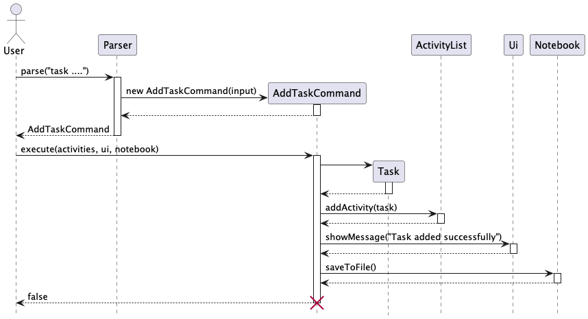
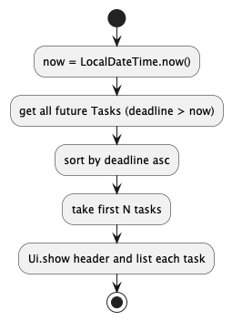

# Developer Guide

- [Acknowledgements](#acknowledgements)
- [Setting up, getting started](#setting-up-getting-started)
- [Design](#design)
  - [Architecture](#architecture)
  - [Parser](#parser-and-commands-component)
  - [Commands](#parser-and-commands-component)
  - [Activity](#activity-and-gpa)
  - [Gpa](#activity-and-gpa)
  - [Storage](#storage)
  - [Ui](#ui)
  - [Exceptions](#exceptions)
- [Implementation](#implementation)
  - [Activities](#activities)
    - [Add Task with priority](#add-task-with-priority-and-robust-datetime-parsing)
    - [Change priority rebalancing](#change-priority-rebalancing)
    - [Check current tasks](#check-current-tasks-nearest-deadlines)
  - [Gpa Tracker](#gpa-tracker)
  - [Parsing helpers](#parsing-helpers)
    - [Day-of-week parsing](#day-of-week-parsing)
- [Appendix A: Product Scope](#appendix-a-product-scope-expanded)
- [Appendix B: User Stories](#appendix-b-user-stories-additional)
- [Appendix C: Non-Functional Requirements](#appendix-c-non-functional-requirements-expanded)
- [Appendix D: Glossary](#appendix-d-glossary-expanded)
- [Appendix E: Instructions for Manual Testing](#appendix-e-instructions-for-manual-testing-full)

---

## Acknowledgements

This Developer Guide follows the general structure and documentation practices used by SE‑EDU projects and other public references. We use PlantUML for diagrams. Below we cite all sources of ideas/code/documentation we reused or adapted, and the extent of reuse.

- SE‑EDU AddressBook Level 3 (AB3)
  - Documentation structure and examples were referenced from AB3’s Developer Guide and User Guide.
  - Links: AB3 DG
  - Extent: Documentation structure and some phrasing inspired; no production code copied unless explicitly stated below.
- CS2113 Main Website
  - Used as reference for diagram drawing, and expectations of what there is to be in DeveloperGuide.
  - Extent: Concepts and notation guidance only.
- SE‑EDU Guides — PlantUML Tutorial
  - Used as reference for authoring and styling diagrams. Link: Using PlantUML @ SE‑EDU/guides.
  - Extent: Concepts and notation guidance only.

## Setting up, getting started
Refer to the project README for setup instructions: [README.md](../README.md)

## Design
### 💡 Tips
The `.puml` files used to create diagrams are in this document `docs/diagrams` folder.

### Architecture

This section gives a high-level overview of Astra’s components and how they interact in a typical command flow. (Astra → Parser → Command → Model/Storage → Ui).

**Key components and responsibilities**

Astra (`astra.astra`): Main program in charge of the app launch and shut down.
- At app launch, it initialises the other components and connects them up.
- During program run, it scans user inputs and maintains the running of the Astra program.
- At shut down, it shuts down the other components and invokes all necessary cleanup.

Astra is built upon these main components:
- [Parser](#parser) (`astra.parser.Parser`): Maps raw input to a concrete command.
- [Commands](#commands) (`astra.command.*`): Execute logic using collaborators.
- [Activity](#activitytype-component)/[Gpa](#gpa-model-details) (`astra.activity.*`, `astra.gpa.*`): In‑memory data for activities and GPA.
- [Storage](#storage-component) (`astra.data.Notebook`): Centralized persistence for activities and GPA.
- [Ui](#ui-component) (`astra.ui.Ui`): Console I/O and help printing.
- [Exceptions](#exceptions) (`astra.exception.*`): Exceptions shared across components.

**Main loop overview**

The main loop below shows how Astra orchestrates parsing, command execution, and persistence each cycle.

- Inputs: a single line of user text (REPL), or a parsed token stream.
- Outputs: a textual response to the user (via Ui) and, when needed, updated persisted state (via Notebook).
- Error modes: parsing errors, command validation errors, IO/persistence failures.
- Success criteria: correct command semantics, consistent persisted state, clear error messages, and no index corruption for list operations.

**How the architecture components interact**

The sequence diagram below shows how components interact when the user issues `delete 1` (or multiple indices like `delete 2`).
  - Commands share a `Command` interface and are executed directly.
  - `Parser`, `Ui`, and `Notebook` are concrete classes used directly.
- Dependencies are passed explicitly into `Command.execute(ActivityList, Ui, Notebook)`, keeping flows easy to trace and limiting global coupling.

**Key points**
- `Parser.parse(input)` returns a concrete `Command`.
- `Command.execute(...)` returns `shouldExit`.
- On non-exiting commands, Astra persists activities using both `writeToFile(activities.toList())` and `saveToFile(activities)`.
- Some commands also call save methods (e.g., delete), which can lead to duplicate writes; see [Storage](#storage-component) for notes.

**Why this architecture (benefits)**
Separation of concerns (SoC)

### Parser and Commands component

API: `astra.parser.Parser`, `astra.command.Command`

How parsing works
- The top-level `Parser` performs command-word routing by inspecting the first token(s) (e.g., add, list, delete, gpa).
- Detailed argument parsing and validation is handled inside each concrete `Command` during construction and/or `execute`.
- Helpers like `DateTimeParser` and `dayOfWeekParser` are used to keep date/day parsing consistent across commands.

Command component then executes the necessary actions and amend data stored in other classes (see diagram below)

How it fits together
- `Parser.parse(input)` identifies the command and returns a concrete `Command`.
- `Command.execute(ActivityList, Ui, Notebook)` validates, mutates ActivityList as needed, may persist via `Notebook`, and reports via `Ui`. It returns a boolean `shouldExit` to control the REPL.

### Activity and GPA

API: `astra.activity.*`, `astra.gpa.*`

The Model (consisting of Activity and GPA) component

- Stores the app’s domain data in memory:
  - Activities: `ActivityList` containing `Activity` subtypes `Task`, `Lecture`, `Tutorial`, `Exam`.
  - GPA: `GpaList` of `GpaEntry` objects.
- Provides operations to create, access, and modify domain objects:
  - Activities: `addActivity`, `deleteActivity`, `getActivity`, `getListSize`, `toList`, and task-specific helpers
    such as `addTaskWithPriority` (rebalances priorities) and deletion that re-denses priorities.
  - GPA: `add`, `remove(1‑based)`, `toList` (unmodifiable), `computeGpa`, `clear`.
- Validation and invariants:
  - `GpaEntry` validates subject (single token), grade (must be in allowed set), and MC (non‑negative); S/U excluded from GPA.
  - Assertions in `GpaList` guard arithmetic and index handling.
- Independence and responsibilities:
  - Activity/GPA is largely independent of Ui/Parser. It does not perform persistence; `Notebook` (Storage) handles file I/O.
  - Note: `ActivityList` currently contains some printing utilities used by commands (e.g., reminders). These are harmless but can be refactored out to keep Activity purely non‑UI.

#### Activities subcomponent

Packages/classes: `astra.activity.*` — `Activity`, `SchoolActivity`, `Task`, `Lecture`, `Tutorial`, `Exam`, `ActivityList`.

Key notes
- Priority management is encapsulated in the model (`addTaskWithPriority`, deletion rebalancing) so multiple commands remain consistent.
- Deadlines and day/time are represented using `java.time` types.

#### GPA subcomponent

Packages/classes: `astra.gpa.*` — `GpaEntry` (validation, grade mapping), `GpaList` (storage + `computeGpa`).

Key notes
- `GpaList.toList()` returns an unmodifiable view to prevent accidental mutation by callers.
- `computeGpa()` ignores S/U and invalid grade points; returns 0.0 when there are no counted MCs.

See [GPA Tracker](#gpa-tracker) for full implementation.

### Storage

API: `astra.data.Notebook`
- Single owner for file I/O: activities (pipe format) and GPA (`gpa.txt` + `gpa.csv`).
- On mutations, commands call save methods on `Notebook`.
  - Activities use `saveToFile(ActivityList)` (CSV with headers written each save).
  - GPA uses `saveGpa()` which writes both pipe (`gpa.txt`) and CSV (`gpa.csv`).
 - Additionally, the main loop persists activities after each non-exiting command using `writeToFile(activities.toList())` (pipe format) and `saveToFile(activities)` (CSV). This ensures durability even if a command forgets to save, at the cost of potential duplicate writes when a command also saves. A future improvement is to standardize persistence in one place (either commands or the loop) to avoid duplication.

### UI

API: `astra.ui.Ui`
- Presents results, lists, errors, and help.
- Delegates parsing to `Parser` and triggers command execution.

### Exceptions

`astra.exception.*` — `InputException`, `GpaInputException`, `FileSystemException`; used to surface user-friendly errors and encapsulate file I/O failures.

---
## Implementation

### Activities

#### Add Task with priority and robust date/time parsing

Flow: The user enters `task <desc> /by <YYYY-MM-DD> <HH:MM> /priority <n>`. The parser returns `AddTaskCommand`, which validates, uses `DateTimeParser` to parse date/time, and inserts the task at the desired priority by bumping existing priorities that are ≥ the requested priority. The command persists via `Notebook.saveToFile(activities)`.

Why
- Keeping parsing and validation in the command enables precise error messages and reuse of the generic `Parser`.
- `ActivityList.addTaskWithPriority` encapsulates the re‑prioritization logic, avoiding scattered priority updates across commands.

Alternatives considered
- Assigning priority based on current list order was rejected as it breaks when tasks are filtered/sorted differently for view.

#### Change priority rebalancing

`changepriority <taskIndex> /to <newPriority>` updates the task and rebalances other tasks to keep a dense 1..N priority band so that the UI and logic remain predictable.

Edge cases handled
- Moving a task down (e.g., 2 → 5): tasks in (2,5] shift up by 1.
- Moving a task up (e.g., 5 → 2): tasks in [2,5) shift down by 1.
- Non‑task indices or out‑of‑range priorities produce user‑friendly errors.

#### Check current tasks (nearest deadlines)

`checkcurrent [n]` lists the n closest upcoming tasks (default 1). It filters for deadlines after “now”, sorts by deadline ascending, and prints the first n.

Rationale
- Keeps the feature pure and deterministic; no mutation, only read and computation.

### GPA Tracker

This section documents the GPA Tracker as implemented in the codebase, and how it interacts with the rest of the
system (Ui, Parser, Commands, Notebook, and the Astra app). It also includes rationale, alternatives considered, and UML
diagrams to aid future developers.

### Overview

GPA Tracker stores module entries (subject, grade, MCs) and computes GPA on demand. It is integrated into the existing
command-based architecture.

Key components and responsibilities

- Parser and Commands
    - `astra.parser.Parser` recognizes GPA-related commands and instantiates the corresponding command classes.
    - Commands in `astra.command`: `AddGpaCommand`, `ListGpaCommand`, `DeleteGpaCommand`, `ComputeGpaCommand` implement
      the behaviour.
- GPA subcomponent
    - `astra.gpa.GpaEntry`: immutable value object for a single module entry; validates inputs and maps letter grades to
      points.
    - `astra.gpa.GpaList`: holds entries and computes GPA, excluding S/U entries.
- Persistence
    - `astra.data.Notebook`: owns a `GpaList`, loads GPA entries at startup, and persists them to `data/gpa.txt` and
      `data/gpa.csv`.
- UI and Application
    - `astra.ui.Ui`: prints feedback, errors, and help content including GPA usage.
    - `astra.Astra`: application entrypoint; runs the REPL loop, wires Parser → Command → Model/Notebook → Ui, and
      persists after each non-exiting command.

### Architecture context (class/component diagram)

Notes

- `Notebook` owns `GpaList` and encapsulates persistence to both pipe format (`gpa.txt`) and CSV (`gpa.csv`).
- Commands operate via `Notebook` to modify/read GPA state and persist changes, keeping I/O in one place.

### Command flows (sequence diagrams)

Add GPA entry — `add gpa <SUBJECT> <GRADE> <MC>`

Compute GPA — `gpa`

List GPA entries — `list gpa`

Delete GPA entry — `delete gpa <INDEX>`

### GPA model details

`GpaEntry`

- Invariants and validation: subject is a single non-blank token; grade is uppercased and validated; MC is non-negative.
- Grade mapping (to grade points): A+/A=5.0, A-=4.5, B+=4.0, B=3.5, B-=3.0, C+=2.5, C=2.0, D+=1.5, D=1.0, F=0.0; S/U are
  excluded.
- Persistence helpers: `toPipe()` and `toCsv()` provide stable line formats.

`GpaList`

- Core ops: `add`, `remove(1-based)`, `toList()` (unmodifiable view), `clear()`.
- GPA computation ignores entries where `isSu()` is true or `gradePoints()` yields `NaN`.
- Defensive assertions guard against invalid states during iteration and arithmetic.

### Persistence design

- Text file: `data/gpa.txt` uses a simple pipe format: `GPA | <SUBJECT> | <GRADE> | <MC>`.
- CSV file: `data/gpa.csv` is written alongside for interoperability (header: `Subject,Grade,MC`).
- Load: `Notebook` tries to read `gpa.txt` at startup; failures are surfaced as `FileSystemException` but do not crash
  the app.
- Save: Commands call `notebook.saveGpa()` after a mutation, which updates both files atomically per run.

Activity for save

### Why this design

- Single owner for persistence (Notebook) keeps I/O concerns centralized and reduces coupling in commands.
- Immutable `GpaEntry` objects simplify reasoning and avoid partial updates.
- Treating S/U as excluded (via `isSu` and `NaN` in `gradePoints`) keeps the computation logic simple while surfacing
  invalid grades early.

### Error handling and edge cases

- Parser validation: GPA commands are routed early by prefix checks in `Parser.parse(...)` to avoid ambiguity with
  general `add/list/delete`.
- Command input validation: friendly error messages via `Ui.showError(...)` for invalid grades, MC tokens, or indices.
- File I/O failures: wrapped as `FileSystemException`, caught in commands or main loop so the app remains usable.
- Empty GPA list: `computeGpa()` returns 0.0 and `list gpa` prints a helpful message.

### Parsing helpers

#### Day-of-week parsing

`Parser.dayOfWeekParser` accepts both numerals (1–7) and text (e.g., mon/Mon/Monday). Errors are reported early with actionable messages.

Design note
- `DateTimeParser` centralizes date/time acceptance criteria while `Parser.dayOfWeekParser` handles day parsing; this separation simplifies testing and reduces coupling.
---

---

## Appendix A: Product Scope (expanded)

Primary users: students managing academic schedules (tasks, lectures, tutorials, exams) and monitoring GPA. Secondary: TAs/instructors demoing command‑driven planners.

Out‑of‑scope: authentication, networked sharing, and calendar sync (proposed future work).

## Appendix B: User Stories (additional)

| Version | As a ... | I want to ... | So that I can ... |
|---------|----------|---------------|-------------------|
| v2.0    | student  | change a task’s priority quickly | focus on what matters first |
| v2.0    | student  | see the next N deadlines | plan my immediate workload |
| v2.0    | student  | list lectures/tutorials by day | plan my day efficiently |
| v2.0    | student  | edit a task deadline | adapt when plans change |

## Appendix C: Non-Functional Requirements 

- Data durability: writes either fully succeed or fail with a clear error; partial writes avoided via overwrite semantics.
- Portability: no native dependencies; runs on JDK 17 across Windows/macOS/Linux.

## Appendix D: Glossary (expanded)

- Priority band — contiguous range 1..N used to rank tasks uniquely.
- Upcoming — a deadline strictly after the current wall‑clock time.

## Appendix E: Instructions for Manual Testing (full)

The following complements existing GPA tests and covers activity features. Copy‑paste the commands as shown.

1) Add tasks and priorities
  - `task CS2113 Quiz /by 2025-11-01 23:59 /priority 1`
  - `task CG2271 Lab /by 2025-10-30 20:00 /priority 1` (expect previously priority‑1 task to shift to 2)
  - `list` (verify ordering/priority in output)

2) Change priority (rebalance)
  - `changepriority 2 /to 1` (the previously index‑2 task should become priority 1; others shift accordingly)
  - `list` (verify priorities are a dense 1..N)

3) Edit deadline
  - `changedeadline 1 /to 2025-10-31 18:00` (updates date/time; verify in list)

4) Check current deadlines
  - `checkcurrent` (shows the single nearest task)
  - `checkcurrent 3` (shows up to three tasks, in ascending deadline order)

5) Filter by day and exam listing
  - Add one lecture and one tutorial (use `lecture ...` and `tutorial ...` with day/time)
  - `checklecture Friday`
  - `checktutorial Wed`
  - `checkexam` (after adding at least one exam)

6) Delete and multiple delete
  - `delete 1` removes item #1
  - Add a few more then `delete 2 4` removes multiple items; list to confirm

7) Error cases to verify guardrails
  - `task X /priority 1` (missing `/by` → friendly error)
  - `changedeadline 99 /to 2025-10-10 20:00` (out‑of‑range index)
  - `changepriority 1 /to 0` (invalid priority)

8) GPA Tracker quick tests
  - Add entries:
    - `add gpa CS2040C A+ 4mc`
    - `add gpa CFG1002 S 4`
    - Expected: success messages printed; files `data/gpa.txt` and `data/gpa.csv` updated
  - List entries:
    - `list gpa` shows indexed list
  - Compute GPA:
    - `gpa` prints `Current GPA: 5.00` for the first entry; with the S entry, it’s still 5.00 as S is excluded
  - Delete entry:
    - `delete gpa 2` removes the second entry
  - Invalid grade:
    - `add gpa CS1231X HH 4` shows an error
