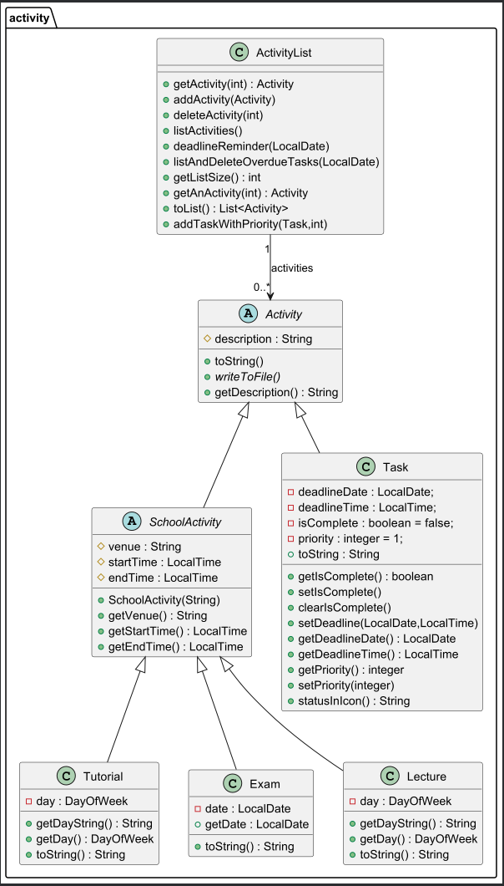
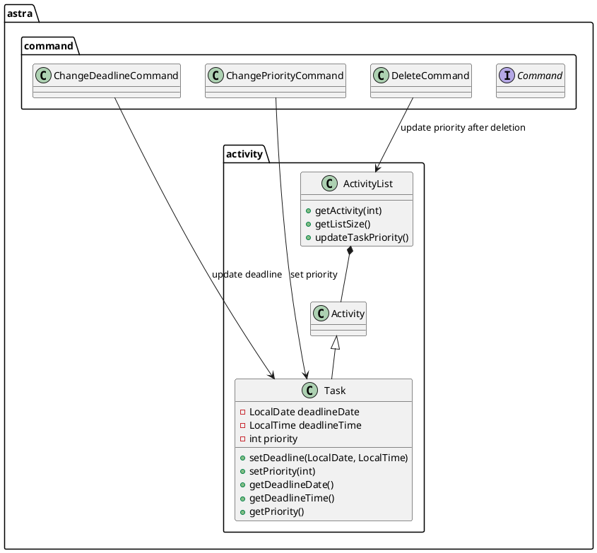
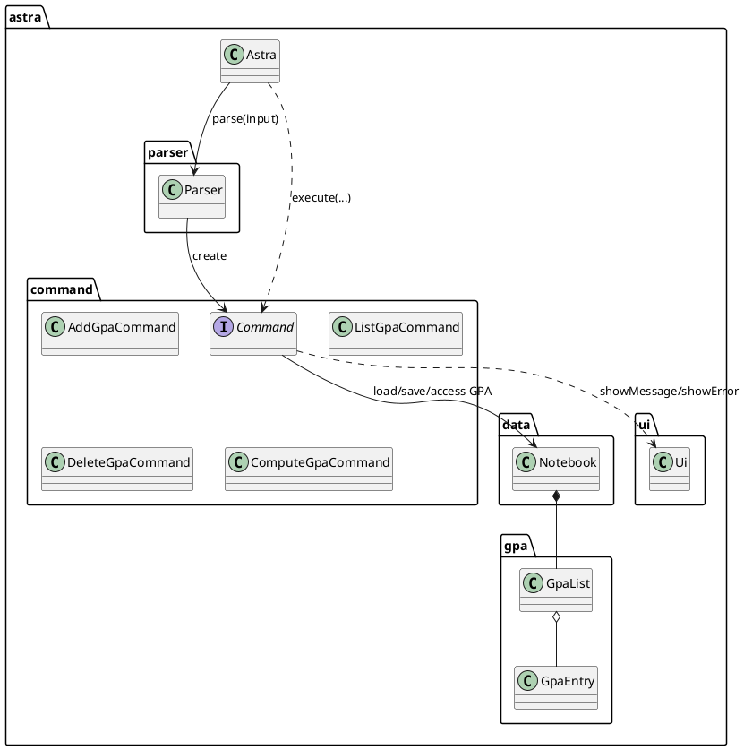
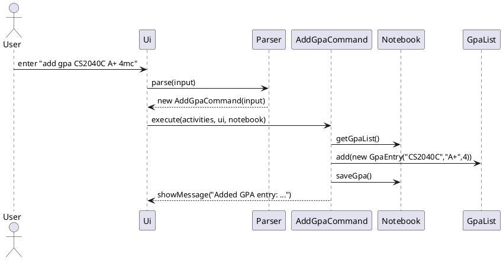
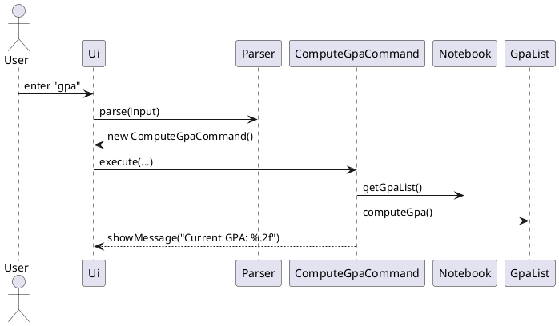
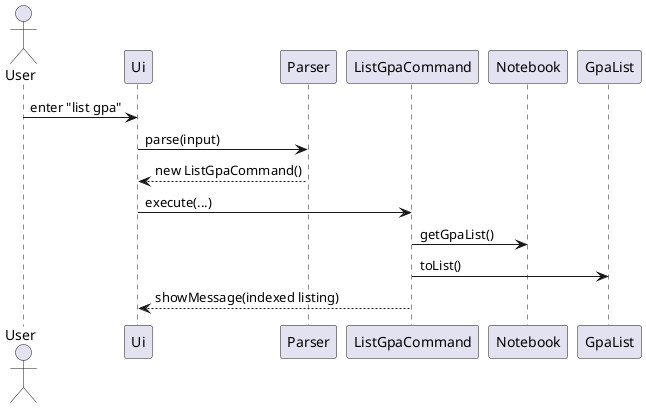
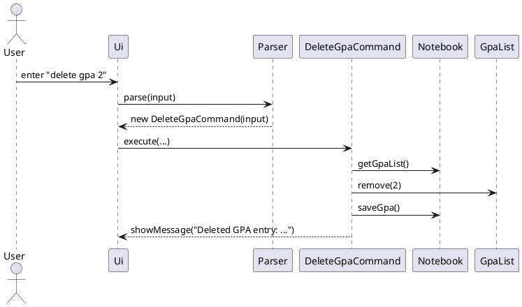
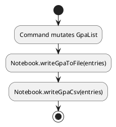

# Developer Guide

- [Acknowledgements](#Acknowledgements)
- [Design & implementation](#design--implementation)
  - [GPA Tracker](#gpa-tracker)
- [Appendix: Requirements](#appendix-requirements)
  - [Product Scope](#product-scope)
  - [User Stories](#user-stories)
  - [Non-Functional Requirements](#non-functional-requirements)
  - [Glossary](#glossary)
- [Appendix: Instructions for manual testing](#instructions-for-manual-testing)
  - [GPA Tracker](#gpa-tracker-1)

---

## Acknowledgements

This Developer Guide builds upon the SE-EDU AB3 template and guidelines. We use PlantUML for diagrams. Any reused ideas
are adapted and cited inline where applicable.

## Design & implementation - activity package

This section shows the classes stored in the activity package and how they are associated to each other

### Overview

The activity package defines the core domain model of the ASTRA application. It manages all user activities (e.g.,
tasks, tutorials, lectures, exams) and provides logic for creating, listing, and maintaining them through the
ActivityList class.

Design Goals

- Provide a flexible abstraction for all types of activities.

- Support both academic activities (tutorials, lectures, exams) and personal tasks (assignments, projects etc).

- Centralize storage and management of activities using ActivityList.

- Facilitate extensibility — new activity types can be added easily by extending Activity.

### Architecture context (class diagram)



## Unmark/Complete Commands

### Overview

UnmarkCommand and CompleteCommand are executed when the user inputs `unmark <index>` or `complete <index>`

### Objectives:

- Help users to update their ActivityList when they either complete or unmark if they completed them by mistake
- Ensure that the proper format of command is used and prompts users when necessary
- Example Code Snippet
    - ``` 
      if (parts.length < 2) {
        ui.showError("Please provide an index: unmark <index>");
        return false;
    - ```
      if (!((Task) currActivity).getIsComplete()) {
        ui.showError("Activity at index " + index + " is already unmarked");
        return false;
- Both Unmark and CompleteCommand have similar command formats, hence they have similar error conditions
- Both have similar sequence codes with the only difference is the Command entity and method used.(unmark: clearIsComplete(), complete: setIsComplete())
### Sequence Diagram (unmark)


---


## Design & implementation

### Task Deadline & Priority System

This section documents the deadline and priority system among task instances and how it interacts with the rest of the system (Ui, Parser, Commands, Notebook, and the Astra app). It also includes UML diagrams to aid future developers.

### Overview

The **Task Deadline and Priority System** extends the `activity` package for `Task` instances to enhance user productivity by enabling time and priority management for all task-type activities.
It introduces **two key features**:

1. **ChangeDeadlineCommand** — allows users to modify the deadline of existing tasks.
2. **Priority Management** — automatically manages task priorities upon creation, update, and deletion.
3. **ChangePriorityCommand** — allows users to swap around the priority of existing tasks.

Together, these features ensure that users can efficiently monitor their task by order of each task's deadline or what they define to be most critical tasks.

---

### Design Goals

* Provide flexible management for task deadlines and priorities.
* Ensure robust validation and error handling for all user inputs.
* Integrate naturally into the existing `Command`, `ActivityList`, and `Task` class structure.
* Keep separation of concerns — UI handles messages, Commands handle logic, ActivityList stores state.

---

### Architecture Context (Class Diagram)



---


### ChangeDeadlineCommand 
**Purpose**: Allows the user to modify the deadline of an existing task.

#### Command Syntax
changepriority (task number) /to (priority)


```
plantuml
@startuml
actor User
participant Ui
participant Parser
participant C as "ChangeDeadlineCommand"
participant AL as "ActivityList"
participant T as "Task"

User -> Ui: enter "changedeadline 3 /to 2025-10-31 18:00"
Ui -> Parser: parse(input)
Parser --> Ui: new ChangeDeadlineCommand(input)
Ui -> C: execute(activities, ui, notebook)
C -> AL: getActivity(2)
AL --> C: Task instance
C -> T: setDeadline(LocalDate, LocalTime)
C --> Ui: showMessage("Deadline updated for task: ...")
@enduml
```


---

### ChangePriority System
**Purpose**: Manages priorities for task instance activities.

#### Command Syntax
 (task number) /to (YYYY-MM-DD) (HH:MM)


```
plantuml
@startuml
class Task {
  - int priority
  + getPriority()
  + setPriority(int)
}
class ChangePriorityCommand {
  + execute(ActivityList, Ui, Notebook)
}
class DeleteCommand {
  + execute(ActivityList, Ui, Notebook)
}

ChangePriorityCommand --> Task : update priority
DeleteCommand --> ActivityList : reassign priorities
@enduml
```


---


### GPA Tracker

This section documents the GPA Tracker as implemented in the codebase, and how it interacts with the rest of the
system (Ui, Parser, Commands, Notebook, and the Astra app). It also includes rationale, alternatives considered, and UML
diagrams to aid future developers.

### Overview

GPA Tracker stores module entries (subject, grade, MCs) and computes GPA on demand. It is integrated into the existing
command-based architecture.

Key components and responsibilities

- Parser and Commands
    - `astra.parser.Parser` recognizes GPA-related commands and instantiates the corresponding command classes.
    - Commands in `astra.command`: `AddGpaCommand`, `ListGpaCommand`, `DeleteGpaCommand`, `ComputeGpaCommand` implement
      the behaviour.
- Model (GPA subcomponent)
    - `astra.gpa.GpaEntry`: immutable value object for a single module entry; validates inputs and maps letter grades to
      points.
    - `astra.gpa.GpaList`: holds entries and computes GPA, excluding S/U entries.
- Persistence
    - `astra.data.Notebook`: owns a `GpaList`, loads GPA entries at startup, and persists them to `data/gpa.txt` and
      `data/gpa.csv`.
- UI and Application
    - `astra.ui.Ui`: prints feedback, errors, and help content including GPA usage.
    - `astra.Astra`: application entrypoint; runs the REPL loop, wires Parser → Command → Model/Notebook → Ui, and
      persists after each non-exiting command.

### Architecture context (class/component diagram)




Notes

- `Notebook` owns `GpaList` and encapsulates persistence to both pipe format (`gpa.txt`) and CSV (`gpa.csv`).
- Commands operate via `Notebook` to modify/read GPA state and persist changes, keeping I/O in one place.

### Command flows (sequence diagrams)

Add GPA entry — `add gpa <SUBJECT> <GRADE> <MC>`




Compute GPA — `gpa`




List GPA entries — `list gpa`




Delete GPA entry — `delete gpa <INDEX>`




### GPA model details

`GpaEntry`

- Invariants and validation: subject is a single non-blank token; grade is uppercased and validated; MC is non-negative.
- Grade mapping (to grade points): A+/A=5.0, A-=4.5, B+=4.0, B=3.5, B-=3.0, C+=2.5, C=2.0, D+=1.5, D=1.0, F=0.0; S/U are
  excluded.
- Persistence helpers: `toPipe()` and `toCsv()` provide stable line formats.

`GpaList`

- Core ops: `add`, `remove(1-based)`, `toList()` (unmodifiable view), `clear()`.
- GPA computation ignores entries where `isSu()` is true or `gradePoints()` yields `NaN`.
- Defensive assertions guard against invalid states during iteration and arithmetic.

### Persistence design

- Text file: `data/gpa.txt` uses a simple pipe format: `GPA | <SUBJECT> | <GRADE> | <MC>`.
- CSV file: `data/gpa.csv` is written alongside for interoperability (header: `Subject,Grade,MC`).
- Load: `Notebook` tries to read `gpa.txt` at startup; failures are surfaced as `FileSystemException` but do not crash
  the app.
- Save: Commands call `notebook.saveGpa()` after a mutation, which updates both files atomically per run.

Activity for save




### Why this design

- Single owner for persistence (Notebook) keeps I/O concerns centralized and reduces coupling in commands.
- Immutable `GpaEntry` objects simplify reasoning and avoid partial updates.
- Treating S/U as excluded (via `isSu` and `NaN` in `gradePoints`) keeps the computation logic simple while surfacing
  invalid grades early.

Alternatives considered

- Store GPA entries in a separate storage component: rejected to avoid duplicating file-handling logic; `Notebook`
  already owns app data.
- Zero MC entries vs. S/U: representing S/U as zero MC distorts denominators; explicit exclusion is clearer and matches
  domain semantics.
- 0-based indices in `DeleteGpaCommand`: 1-based indexing matches user mental model and existing command patterns.

### Error handling and edge cases

- Parser validation: GPA commands are routed early by prefix checks in `Parser.parse(...)` to avoid ambiguity with
  general `add/list/delete`.
- Command input validation: friendly error messages via `Ui.showError(...)` for invalid grades, MC tokens, or indices.
- File I/O failures: wrapped as `FileSystemException`, caught in commands or main loop so the app remains usable.
- Empty GPA list: `computeGpa()` returns 0.0 and `list gpa` prints a helpful message.


### Per-member enhancement write-ups (templates)

Each member should document at least one enhancement implemented or planned. Use the template below, include 1+ page
with diagrams where useful. Replace the placeholder name with your own and add more sections if needed.

#### Member: <Your Name> — GPA Tracker core and persistence

- Scope: Added GPA commands (`add gpa`, `list gpa`, `delete gpa`, `gpa`), model (`GpaEntry`, `GpaList`), and persistence
  via `Notebook`.
- Design and implementation: see sections above. Key code references: `astra.command.AddGpaCommand`,
  `astra.gpa.GpaList`, `astra.data.Notebook`.
- Rationale: centralized persistence, clear invariants, simple GPA arithmetic with S/U exclusion.
- Alternatives: storing GPA separately; allowing multi-word subjects; different grade scale handling.
- Sequence diagram: add flow (reuse diagram above); class diagram: GPA subcomponent (reuse architecture diagram
  excerpt).
- Future work: edit GPA entries; S/U toggling without deletion; semester tagging.

#### Member: <Name> — Parser routing and help UX (planned/implemented)

- Scope: Dedicated prefix checks for GPA to disambiguate overlapping verbs; extended `Ui.showHelp()` to include GPA
  commands.
- Rationale: reduces accidental routing to generic `add/list/delete` and guides users.
- Alternatives: argument tokenization in Parser; sub-parser for GPA.
- Diagram: short sequence diagram showing Parser routing to GPA commands.

#### Member: <Name> — GPA CSV interoperability (planned)

- Scope: CSV writer with header; potential CSV import with validation and merge policies.
- Rationale: allow users to use spreadsheet tools; keep `gpa.txt` as the canonical text format.
- Diagram: import sequence (planned), activity diagram for merge policy.

Add more member sections as needed following the same structure.

---

## Appendix: Requirements

### Product scope

**Target user profile**:
- University student needing to keep track of their schedule
- Prefers simple desktop apps over others
- Prefers typing over mouse interactions
- Comfortable using command line interaction applications
- Students who prefer a keyboard-driven CLI to track academic activities (tasks/lectures/tutorials/exams) and GPA.

**Value proposition**

Keep all academic planning and GPA tracking in one lightweight, fast, offline tool with transparent plain-text storage.

### User Stories

| Version | As a ... | I want to ...             | So that I can ...                                      |
|---------|----------|---------------------------|--------------------------------------------------------|
| v1.0    | new user | see usage instructions    | refer to them when I forget how to use the application |
| v2.0    | user     | track tasks and schedules | plan my week efficiently                               |
| v2.0    | student  | track my modules and GPA  | know my academic standing quickly                      |

### Non-Functional Requirements

- Works on Windows/macOS/Linux with JDK 17.
- Stores data in simple text files under `data/` directory.
- Handles invalid inputs gracefully without crashing.

### Glossary

- MC: Module Credits.
- S/U: Satisfactory/Unsatisfactory grading; excluded from GPA.

## Instructions for manual testing

### GPA Tracker

- Add entries:
    - `add gpa CS2040C A+ 4mc`
    - `add gpa CFG1002 S 4`
    - Expected: success messages printed; files `data/gpa.txt` and `data/gpa.csv` updated
- List entries:
    - `list gpa` shows indexed list
- Compute GPA:
    - `gpa` prints `Current GPA: 5.00` for the first entry; with the S entry, it’s still 5.00 as S is excluded
- Delete entry:
    - `delete gpa 2` removes the second entry
- Invalid grade:
    - `add gpa CS1231X HH 4` shows an error

