# Developer Guide

- [Acknowledgements](#acknowledgements)
- [Setting up, getting started](#setting-up-getting-started)
- [Design](#design)
  - [Architecture](#architecture)
  - [Parser](#parser-and-commands-component)
  - [Commands](#parser-and-commands-component)
  - [Activity](#activity-and-gpa)
  - [Gpa](#activity-and-gpa)
  - [Storage](#storage)
  - [Ui](#ui)
  - [Exceptions](#exceptions)
- [Implementation](#implementation)
  - [Activities](#activities)
    - [Add Task with priority](#add-task-with-priority-and-robust-datetime-parsing)
    - [Task Deadline & Priority System](#task-deadline--priority-system)
    - [Change priority rebalancing](#change-priority-rebalancing)
    - [Check current tasks](#check-current-tasks-nearest-deadlines)
  - [Gpa Tracker](#gpa-tracker)
  - [Parsing helpers](#parsing-helpers)
    - [Day-of-week parsing](#day-of-week-parsing)
- [Appendix A: Product Scope](#appendix-a-product-scope-expanded)
- [Appendix B: User Stories](#appendix-b-user-stories-additional)
- [Appendix C: Non-Functional Requirements](#appendix-c-non-functional-requirements)
- [Appendix D: Glossary](#appendix-d-glossary-expanded)
- [Appendix E: Instructions for Manual Testing](#appendix-e-instructions-for-manual-testing-full)

---


## Acknowledgements

This Developer Guide follows the general structure and documentation practices used by SE‑EDU projects and other public references. We use PlantUML for diagrams. Below we cite all sources of ideas/code/documentation we reused or adapted, and the extent of reuse.

- SE‑EDU AddressBook Level 3 (AB3)
  - Documentation structure and examples were referenced from AB3’s Developer Guide and User Guide.
  - Links: AB3 DG
  - Extent: Documentation structure and some phrasing inspired; no production code copied unless explicitly stated below.
- CS2113 Main Website
  - Used as reference for diagram drawing, and expectations of what there is to be in DeveloperGuide.
  - Extent: Concepts and notation guidance only.
- SE‑EDU Guides — PlantUML Tutorial
  - Used as reference for authoring and styling diagrams. Link: Using PlantUML @ SE‑EDU/guides.
  - Extent: Concepts and notation guidance only.

## Setting up, getting started

Refer to the project README for setup instructions: [README.md](../README.md)

## Design

### 💡 Tips

The `.puml` files used to create diagrams are in this document `docs/diagrams` folder.

### Architecture

This section gives a high-level overview of Astra’s components and how they interact in a typical command flow. (Astra → Parser → Command → Model/Storage → Ui).

**Key components and responsibilities**

Astra (`astra.astra`): Main program in charge of the app launch and shut down.

- At app launch, it initialises the other components and connects them up.
- During program run, it scans user inputs and maintains the running of the Astra program.
- At shut down, it shuts down the other components and invokes all necessary cleanup.

Astra is built upon these main components:
- [Parser](#parser-and-commands-component) (`astra.parser.Parser`): Maps raw input to a concrete command.
- [Commands](#parser-and-commands-component) (`astra.command.*`): Execute logic using collaborators.
- [Activity](#activity-and-gpa)/[Gpa](#gpa-model-details) (`astra.activity.*`, `astra.gpa.*`): In‑memory data for activities and GPA.
- [Storage](#storage) (`astra.data.Notebook`): Centralized persistence for activities and GPA.
- [Ui](#ui) (`astra.ui.Ui`): Console I/O and help printing.
- [Exceptions](#exceptions) (`astra.exception.*`): Exceptions shared across components.

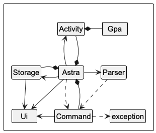

**Main loop overview**

The main loop below shows how Astra orchestrates parsing, command execution, and persistence each cycle.

- Inputs: a single line of user text (REPL), or a parsed token stream.
- Outputs: a textual response to the user (via Ui) and, when needed, updated persisted state (via Notebook).
- Error modes: parsing errors, command validation errors, IO/persistence failures.
- Success criteria: correct command semantics, consistent persisted state, clear error messages, and no index corruption for list operations.

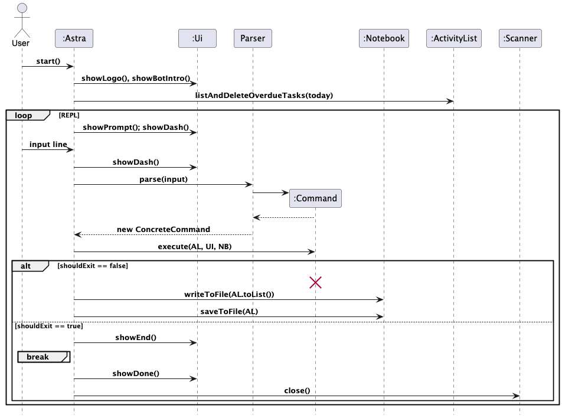

**How the architecture components interact**

The sequence diagram below shows how components interact when the user issues `delete 1` (or multiple indices like `delete 2`).

- Commands share a `Command` interface and are executed directly.
- `Parser`, `Ui`, and `Notebook` are concrete classes used directly.
- Dependencies are passed explicitly into `Command.execute(ActivityList, Ui, Notebook)`, keeping flows easy to trace and limiting global coupling.

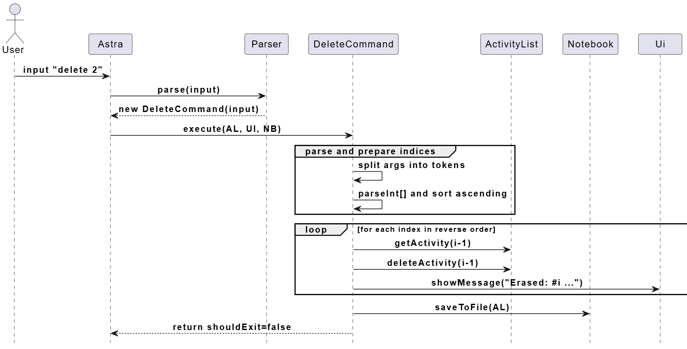

**Key points**

- `Parser.parse(input)` returns a concrete `Command`.
- `Command.execute(...)` returns `shouldExit`.
- On non-exiting commands, Astra persists activities using both `writeToFile(activities.toList())` and `saveToFile(activities)`.
- Some commands also call save methods (e.g., delete), which can lead to duplicate writes; see [Storage](#storage) for notes.

**Why this architecture (benefits)**
Separation of concerns (SoC)

### Parser and Commands component

API: `astra.parser.Parser`, `astra.command.Command`

How parsing works

- The top-level `Parser` performs command-word routing by inspecting the first token(s) (e.g., add, list, delete, gpa).
- Detailed argument parsing and validation is handled inside each concrete `Command` during construction and/or `execute`.
- Helpers like `DateTimeParser` and `dayOfWeekParser` are used to keep date/day parsing consistent across commands.

Command component then executes the necessary actions and amend data stored in other classes (see diagram below)

How it fits together

- `Parser.parse(input)` identifies the command and returns a concrete `Command`.
- `Command.execute(ActivityList, Ui, Notebook)` validates, mutates ActivityList as needed, may persist via `Notebook`, and reports via `Ui`. It returns a boolean `shouldExit` to control the REPL.

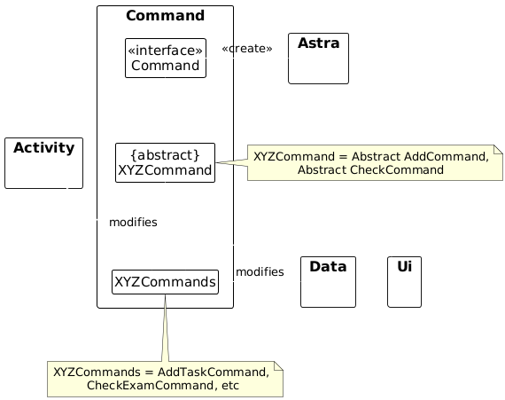

### Activity and GPA

API: `astra.activity.*`, `astra.gpa.*`

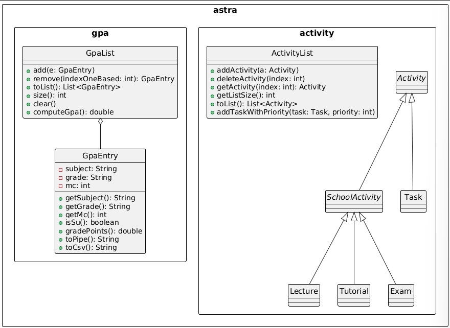

The Model (consisting of Activity and GPA) component

- Stores the app’s domain data in memory:
  - Activities: `ActivityList` containing `Activity` subtypes `Task`, `Lecture`, `Tutorial`, `Exam`.
  - GPA: `GpaList` of `GpaEntry` objects.
- Provides operations to create, access, and modify domain objects:
  - Activities: `addActivity`, `deleteActivity`, `getActivity`, `getListSize`, `toList`, and task-specific helpers
    such as `addTaskWithPriority` (rebalances priorities) and deletion that re-denses priorities.
  - GPA: `add`, `remove(1‑based)`, `toList` (unmodifiable), `computeGpa`, `clear`.
- Validation and invariants:
  - `GpaEntry` validates subject (single token), grade (must be in allowed set), and MC (non‑negative); S/U excluded from GPA.
  - Assertions in `GpaList` guard arithmetic and index handling.
- Independence and responsibilities:
  - Activity/GPA is largely independent of Ui/Parser. It does not perform persistence; `Notebook` (Storage) handles file I/O.
  - Note: `ActivityList` currently contains some printing utilities used by commands (e.g., reminders). These are harmless but can be refactored out to keep Activity purely non‑UI.

#### Activities subcomponent

Packages/classes: `astra.activity.*` — `Activity`, `SchoolActivity`, `Task`, `Lecture`, `Tutorial`, `Exam`, `ActivityList`.

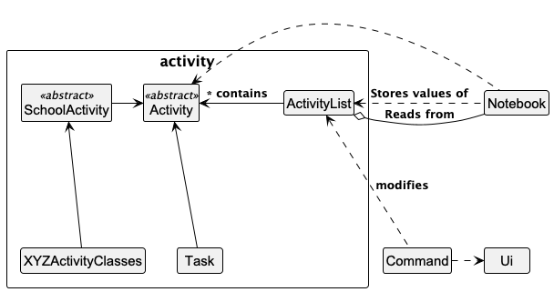

Key notes

- Priority management is encapsulated in the model (`addTaskWithPriority`, deletion rebalancing) so multiple commands remain consistent.
- Deadlines and day/time are represented using `java.time` types.

#### GPA subcomponent

Packages/classes: `astra.gpa.*` — `GpaEntry` (validation, grade mapping), `GpaList` (storage + `computeGpa`).

Key notes

- `GpaList.toList()` returns an unmodifiable view to prevent accidental mutation by callers.
- `computeGpa()` ignores S/U and invalid grade points; returns 0.0 when there are no counted MCs.

See [GPA Tracker](#gpa-tracker) for full implementation.

### Storage

API: `astra.data.Notebook`

- Single owner for file I/O: activities (pipe format) and GPA (`gpa.txt` + `gpa.csv`).
- On mutations, commands call save methods on `Notebook`.
  - Activities use `saveToFile(ActivityList)` (CSV with headers written each save).
  - GPA uses `saveGpa()` which writes both pipe (`gpa.txt`) and CSV (`gpa.csv`).
- Additionally, the main loop persists activities after each non-exiting command using `writeToFile(activities.toList())` (pipe format) and `saveToFile(activities)` (CSV). This ensures durability even if a command forgets to save, at the cost of potential duplicate writes when a command also saves. A future improvement is to standardize persistence in one place (either commands or the loop) to avoid duplication.

### UI

API: `astra.ui.Ui`

- Presents results, lists, errors, and help.
- Delegates parsing to `Parser` and triggers command execution.

### Exceptions

`astra.exception.*` — `InputException`, `GpaInputException`, `FileSystemException`; used to surface user-friendly errors and encapsulate file I/O failures.

---

## Implementation

### Activities

#### Add Task with priority and robust date/time parsing

Flow: The user enters `task <desc> /by <YYYY-MM-DD> <HH:MM> /priority <n>`. The parser returns an `AddCommand` (task variant), which validates, uses `DateTimeParser` to parse date/time, and inserts the task at the desired priority by bumping existing priorities that are ≥ the requested priority. The command persists via `Notebook.saveToFile(activities)`.

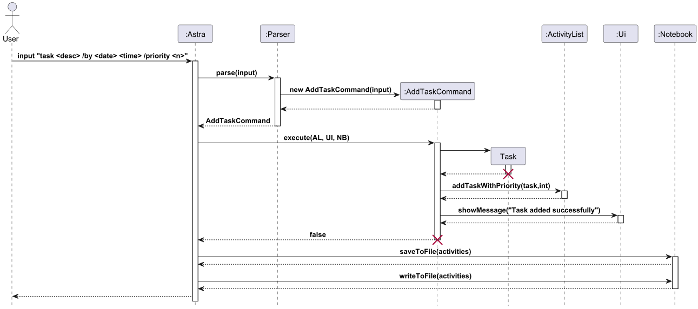

Why

- Keeping parsing and validation in the command enables precise error messages and reuse of the generic `Parser`.
- `ActivityList.addTaskWithPriority` encapsulates the re‑prioritization logic, avoiding scattered priority updates across commands.

Alternatives considered

- Assigning priority based on current list order was rejected as it breaks when tasks are filtered/sorted differently for view.

---

### Task Unmarking and Completing(marking)
Flow: The user enters `unmark/complete <index>`. The parser returns either `UnmarkCommand` or `CompleteCommand` and does the execute() method accordingly. Activity at the index is retrieved and marked/unmarked it if it is a task.
UnmarkCommand will be used as an example for the sequence diagram as they share similar sequences. The main difference is unmarkCommand will call clearIsComplete() while CompleteCommand will call setIsComplete().
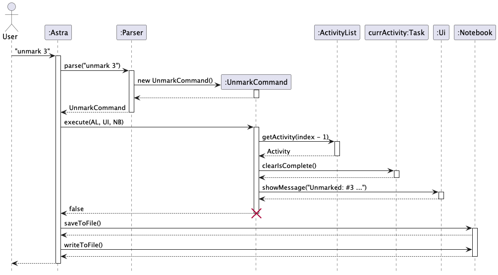

---

### Delete 
Flow: The user enters `delete <index>`. The parser returns `DeleteCOmmand` and does execute(). Activity at index is deleted from the ActivityList which is then saved to the data folder.

Deleting multiple activities: delete activities in descending order of activity index.
- Reasonability: deleting the activity with the largest index will not affect the indexes of previous activities, so no need to change the index of the activities to be deleted.
- For example: `delete 1 3`: delete the third activity in the ActivityList first, then delete the first one.

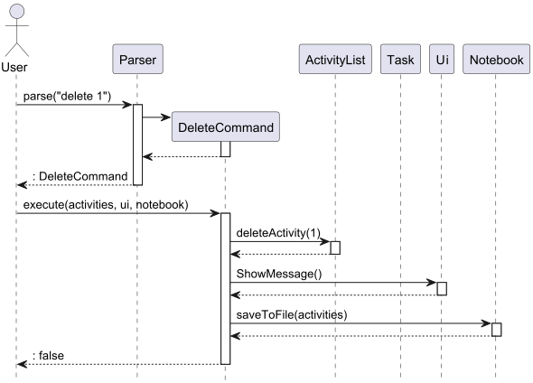

### Task Deadline & Priority System

This section documents the deadline and priority system among task instances and how it interacts with the rest of the system (Ui, Parser, Commands, Notebook, and the Astra app). It also includes UML diagrams to aid future developers.

### Overview

The **Task Deadline and Priority System** extends the `activity` package for `Task` instances to enhance user productivity by enabling time and priority management for all task-type activities.
It introduces **two key features**:

1. **CheckCurrent** — allows users to display [n] amounts of Task based on earliest deadline, default n = 1.
2. **ChangeDeadlineCommand** — allows users to modify the deadline of existing tasks.
3. **CheckPriority** — allows users to display all Task in the order of priority (lowest to highest number)
4. **ChangePriorityCommand** — allows users to swap around the priority of existing tasks.
5. **Priority Management** — automatically manages task priorities upon creation, update, and deletion.

Together, these features ensure that users can efficiently monitor their task by order of each task's deadline or what they define to be most critical tasks.

---


#### Check current tasks (Earliest Deadlines)

**Purpose**: Show the nearest upcoming task deadlines (future tasks), optionally limited by a count. Useful to get a quick glance at what is due soon.

`checkcurrent [n]` lists the n closest upcoming tasks (default 1). It filters for deadlines after “now”, sorts by deadline ascending, and prints the first n.

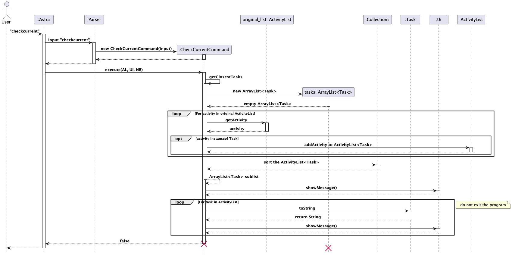

#### Behaviour

- Filters `ActivityList` for `Task` instances whose deadline is after current time.
- Sorts matching tasks by combined `deadlineDate` + `deadlineTime` (earliest first).
- Returns up to `n` tasks where `n` is provided by the user; defaults to 1 when omitted or invalid.
- Uses `Ui` to display friendly messages when no future tasks exist.

---

#### Change Deadline Command

Code format — `changedeadline <taskNumber> /to <YYYY-MM-DD> <HH:MM>`. Finds the <taskNumber> activity in the activity list, checks if it is a task before changing and validating the deadline based on DateTime format

Change Deadline of task 3 — `changedeadline 3 /to 2025-10-31 18:00`
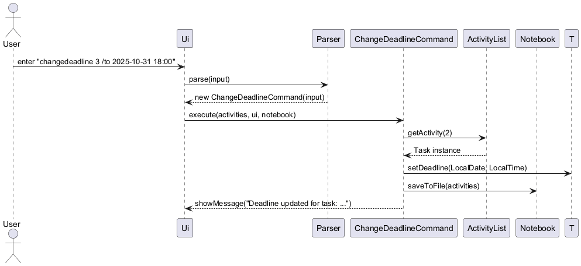

#### Validation checks and behaviours

- Validates `/to` presence and the index argument.
- Uses `DateTimeParser` to accept flexible date/time formats (YYYY-MM-DD, or day names where supported).
- Ensures selected activity is a `Task`; otherwise shows an error via `Ui`.
- Persists changes through `Notebook.writeToFile(...)` and `Notebook.saveToFile(...)` so the updated deadline survives restarts.

---

#### CheckPriorityCommand

Display all tasks ordered by their priority — `checkpriority`

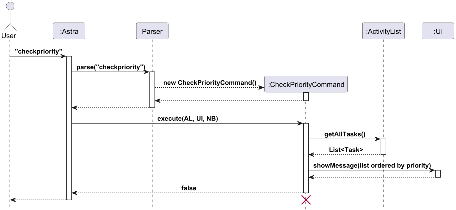


#### Behaviour
- Filters `ActivityList` for all `Task` instances and places into new `ActivityList` instance.
- Sorts matching tasks by priority through `task.getPriority`.
- Uses `Ui` to display friendly messages when no tasks exist.

---

#### Change priority rebalancing

Update and rebalance task priority — `changepriority <taskIndex> /to <newPriority>`

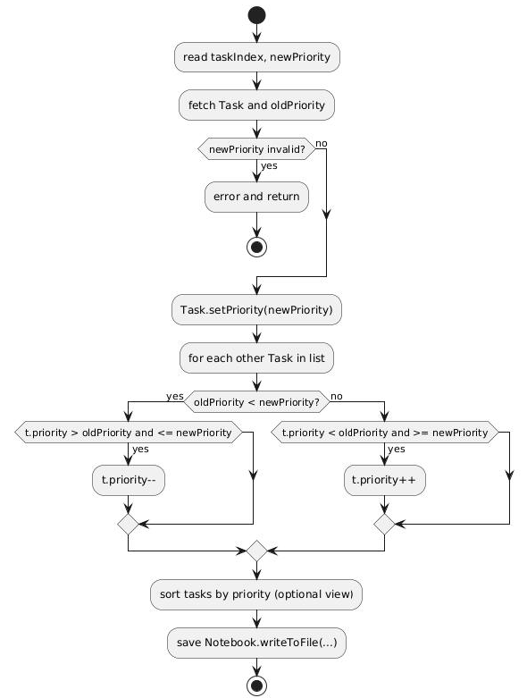


---

Change priority of task 3 — `changepriority 3 /to 1`

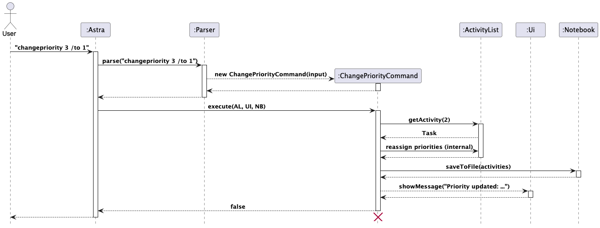

#### Behavior Edge cases handled

- Moving a task down (e.g., 2 → 5): tasks in (2,5] shift up by 1.
- Moving a task up (e.g., 5 → 2): tasks in [2,5) shift down by 1.
- Non‑task indices or out‑of‑range priorities produce user‑friendly errors.

---

### GPA Tracker

This section documents the GPA Tracker as implemented in the codebase, and how it interacts with the rest of the
system (Ui, Parser, Commands, Notebook, and the Astra app). It also includes rationale, alternatives considered, and UML
diagrams to aid future developers.

### Overview

GPA Tracker stores module entries (subject, grade, MCs) and computes GPA on demand. It is integrated into the existing
command-based architecture.

Key components and responsibilities

- Parser and Commands
  - `astra.parser.Parser` recognizes GPA-related commands and instantiates the corresponding command classes.
  - Commands in `astra.command`: `AddGpaCommand`, `ListGpaCommand`, `DeleteGpaCommand`, `ComputeGpaCommand` implement
    the behaviour.
- GPA subcomponent
  - `astra.gpa.GpaEntry`: immutable value object for a single module entry; validates inputs and maps letter grades to
    points.
  - `astra.gpa.GpaList`: holds entries and computes GPA, excluding S/U entries.
- Persistence
  - `astra.data.Notebook`: owns a `GpaList`, loads GPA entries at startup, and persists them to `data/gpa.txt` and
    `data/gpa.csv`.
- UI and Application
  - `astra.ui.Ui`: prints feedback, errors, and help content including GPA usage.
  - `astra.Astra`: application entrypoint; runs the REPL loop, wires Parser → Command → Model/Notebook → Ui, and
    persists after each non-exiting command.

### Architecture context (class/component diagram)

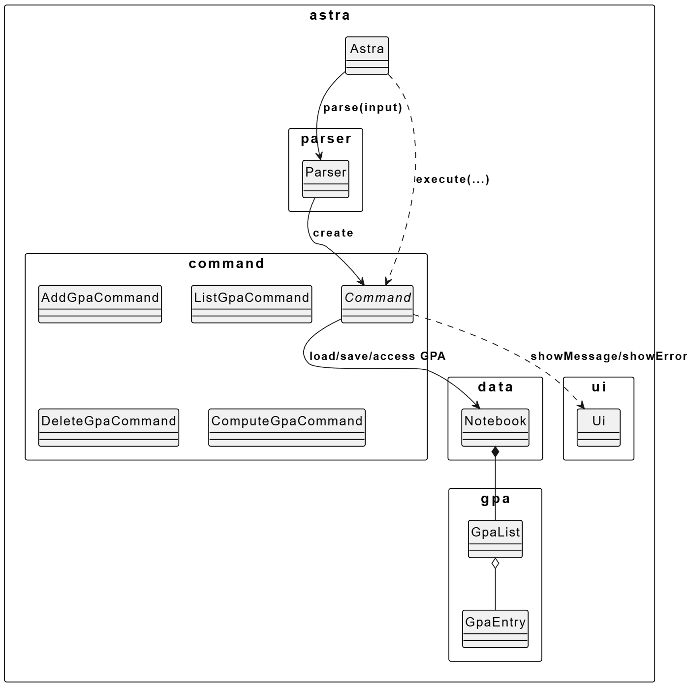

Notes

- `Notebook` owns `GpaList` and encapsulates persistence to both pipe format (`gpa.txt`) and CSV (`gpa.csv`).
- Commands operate via `Notebook` to modify/read GPA state and persist changes, keeping I/O in one place.

### Command flows (sequence diagrams)

Add GPA entry — `add gpa <SUBJECT> <GRADE> <MC>`

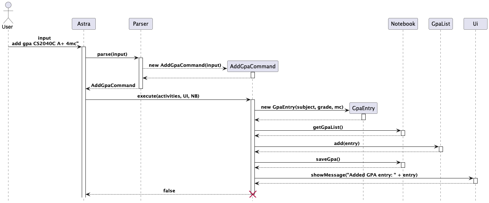

Compute GPA — `gpa`

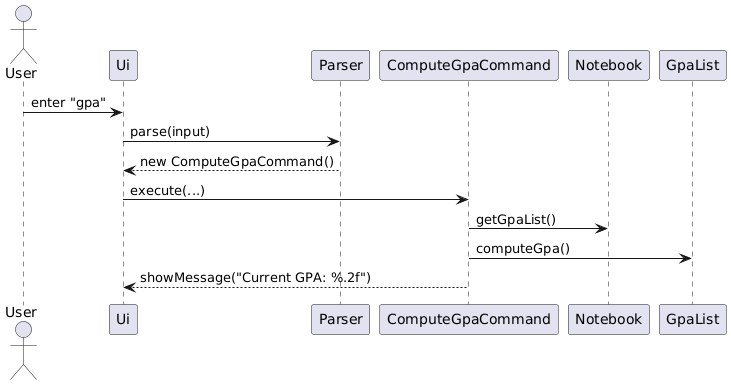

List GPA entries — `list gpa`

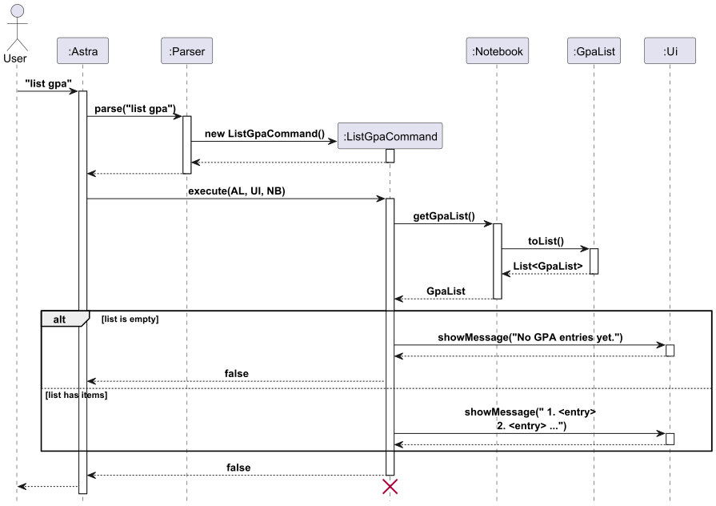

Delete GPA entry — `delete gpa <INDEX>`

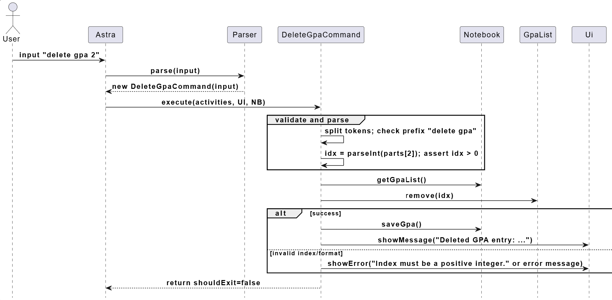

### GPA model details

`GpaEntry`

- Invariants and validation: subject is a single non-blank token; grade is uppercased and validated; MC is non-negative.
- Grade mapping (to grade points): A+/A=5.0, A-=4.5, B+=4.0, B=3.5, B-=3.0, C+=2.5, C=2.0, D+=1.5, D=1.0, F=0.0; S/U are
  excluded.
- Persistence helpers: `toPipe()` and `toCsv()` provide stable line formats.

`GpaList`

- Core ops: `add`, `remove(1-based)`, `toList()` (unmodifiable view), `clear()`.
- GPA computation ignores entries where `isSu()` is true or `gradePoints()` yields `NaN`.
- Defensive assertions guard against invalid states during iteration and arithmetic.

### Persistence design

- Text file: `data/gpa.txt` uses a simple pipe format: `GPA | <SUBJECT> | <GRADE> | <MC>`.
- CSV file: `data/gpa.csv` is written alongside for interoperability (header: `Subject,Grade,MC`).
- Load: `Notebook` tries to read `gpa.txt` at startup; failures are surfaced as `FileSystemException` but do not crash
  the app.
- Save: Commands call `notebook.saveGpa()` after a mutation, which updates both files atomically per run.

Activity for save

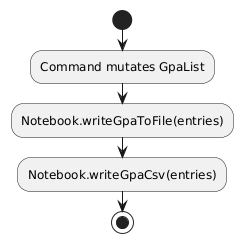

### Why this design

- Single owner for persistence (Notebook) keeps I/O concerns centralized and reduces coupling in commands.
- Immutable `GpaEntry` objects simplify reasoning and avoid partial updates.
- Treating S/U as excluded (via `isSu` and `NaN` in `gradePoints`) keeps the computation logic simple while surfacing
  invalid grades early.

### Error handling and edge cases

- Parser validation: GPA commands are routed early by prefix checks in `Parser.parse(...)` to avoid ambiguity with
  general `add/list/delete`.
- Command input validation: friendly error messages via `Ui.showError(...)` for invalid grades, MC tokens, or indices.
- File I/O failures: wrapped as `FileSystemException`, caught in commands or main loop so the app remains usable.
- Empty GPA list: `computeGpa()` returns 0.0 and `list gpa` prints a helpful message.

### Parsing helpers

#### Day-of-week parsing

`Parser.dayOfWeekParser` accepts both numerals (1–7) and text (e.g., mon/Mon/Monday). Errors are reported early with actionable messages.

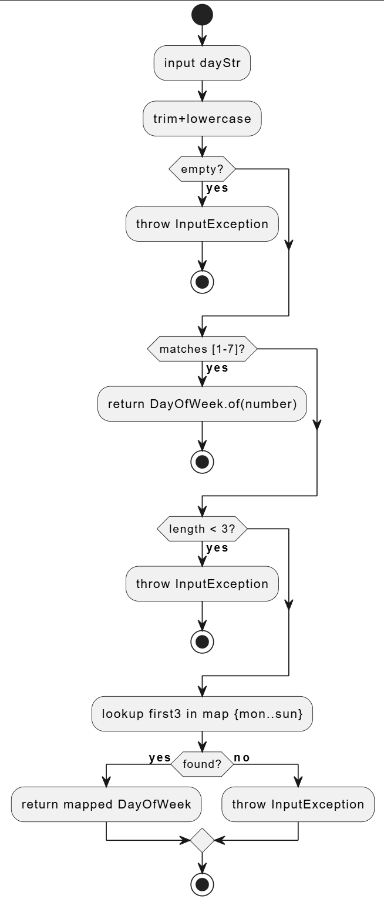

Design note

- `DateTimeParser` centralizes date/time acceptance criteria while `Parser.dayOfWeekParser` handles day parsing; this separation simplifies testing and reduces coupling.

---

---

## Appendix A: Product Scope (expanded)

Primary users: students managing academic schedules (tasks, lectures, tutorials, exams) and monitoring GPA. Secondary: TAs/instructors demoing command‑driven planners.

Out‑of‑scope: authentication, networked sharing, and calendar sync (proposed future work).

## Appendix B: User Stories (additional)


| Version | As a ...                                    | I want to ...                                        | So that I can ...                                       |
|---------|---------------------------------------------|------------------------------------------------------|---------------------------------------------------------|
| v1.0    | New/forgetful user                          | see usage instructions                               | refer to them when I forget how to use the application  |
| v1.0    | Student                                     | view all the tasks I need to do                      | see what is scheduled ahead                             |
| v1.0    | Student                                     | Add tasks and their deadlines                        | track deadlines                                         |
| v1.0    | User                                        | Delete tasks                                         | reduce clutter in my list of tasks                      |
| v1.0    | Student who likes to keep track of my tasks | check what the current task is                       | know what must be done right now                        |
| v1.0    | Student who likes to keep track of my tasks | Mark tasks as complete/incomplete                    | know if I have finished a task                          |
| v1.0    | Student who likes to keep track of my tasks | Change deadline of tasks                             | Change the deadline if i put it in wrongly              |
| v1.0    | Cautious student who forgets dates easily   | Check upcoming examinations                          | see my upcoming examinations                            |
| v1.0    | Student who forgets his weekly schedule     | Check what lectures I have                           | see what lecture I have for the day                     |
| v1.0    | Student who forgets his weekly schedule     | Check what tutorials I have                          | see what tutorials I have for the day                   |
| v1.0    | User                                        | See my added activities between startups             | have continuity between each start of the programme     |
| v2.0    | Student                                     | List tasks by their deadline                         | see the order of tasks, by the earliest deadline first  |
| v2.0    | Student                                     | List tasks by their priority                         | see the order of tasks, by the most important one first |
| v2.0    | Student who likes easy usability            | Have more ways to input dates and times              | have an easier time entering them in                    |
| v2.0    | Forgetful student                           | Be reminded of oncoming deadline                     | be reminded of the work to be done                      |
| v2.0    | User who likes efficiency                   | Delete multiple tasks                                | quickly delete and clear completed tasks                |
| v2.0    | User who is not good at managing data/lists | Have completed tasks or passed exams be auto-deleted | not have to manually clear them all                     |
| v2.0    | User                                        | track tasks and schedules                            | plan my week efficiently                                |
| v2.0    | Student                                     | track my modules and GPA                             | know my academic standing quickly                       |
| v2.0    | Student                                     | change a task’s priority quickly                     | focus on what matters first                             |
| v2.0    | Student                                     | see the next N deadlines                             | plan my immediate workload                              |
| v2.0    | Student                                     | list lectures/tutorials by day                       | plan my day efficiently                                 |
| v2.0    | Student whose deadlines always change       | edit a task deadline                                 | adapt when plans change                                 |


## Appendix C: Non-Functional Requirements

- Data durability: writes either fully succeed or fail with a clear error; partial writes avoided via overwrite semantics.
- Portability: no native dependencies; runs on JDK 17 across Windows/macOS/Linux.

## Appendix D: Glossary (expanded)

- Priority band — contiguous range 1..N used to rank tasks uniquely.
- Upcoming — a deadline strictly after the current wall‑clock time.

## Appendix E: Instructions for Manual Testing (full)

The following complements existing GPA tests and covers activity features. Copy‑paste the commands as shown after starting Astra.

1. Add tasks and priorities and all schoolActivities
    
    1. Test Case:
       - `task CS2113 Quiz /by 2025-11-01 23:59 /priority 1`
       - `task CG2271 Lab /by 2025-10-30 20:00 /priority 1` (expect previously priority‑1 task to shift to 2)
       - `lecture CS2113 /place LT9 /day Friday /from 16:00 /to 18:00`
       - `tutorial CS2113 T1 /place COM2-0207 /day Wednesday /from 12:00 /to 13:00`
       - `exam CS2107 Midterm /place MPSH1 /date 2025-10-10 /from 10:00 /to 12:00`
       - `list` to show the output

        Expected Output:
       ````
          ------------------------------------------------------------
          1. [ ]CS2113 Quiz | Deadline: 1 Nov, 2359H | Priority: 2
          2. [ ]CG2271 Lab | Deadline: 30 Oct, 2000H | Priority: 1
          3. Lecture | CS2113 | Venue: LT9 | Friday | Duration: 1600H to 1800H
          4. Tutorial | CS2113 T1 | Venue: COM2-0207 | Wednesday | Duration: 1200H to 1300H
          5. Exam | CS2107 Midterm | Venue: MPSH1 | Date: 10 Oct | Duration: 1000H to 1200H
          ------------------------------------------------------------
       ````
    2. Test Case: `task CS2113 Quiz /by 2025-11-01 23:59`
       - Expected Output: error showing missing input
       - Similar output for other add commands with missing inputs

2. Change priority (rebalance)
   
    1. Prerequisite:
       1) Ensure there are 2 tasks in the ActivityList
       2) Use the task command to add if necessary
       3) Ensure that the task at the first index has priority 2 
   
   2. Test Case: `changepriority 1 /to 1`
      - Expected Output: The first task's priority will change to 1 while the previous task with priority 1 will change to 2
   3. Test Case: `changepriority 1 /to 2`
      - Expected Output: The first task's priority will change to 2 while the previous task with priority 2 will change to 1
   4. Test Case: `changepriority 1 /to a`
      - Expepted Output: error showing new priority must be an integer
   5. Test Case: `changepriority a /to 1`
      - Expected Output: error showing task number must be integer
   6. Test Case: `changepriority 1 /to 3` where there are only two tasks in the list
      - Excepted Output: error showing new priority must be between 1 and 2
   7. Test Case: `changepriority 1 /to 2` where priority of task in index 1 is already 2
      - Expected Output: error showing the task already has this priority

3. Edit deadline
    1. Prerequisite:
        1) Ensure that there is at least 1 task in the ActivityList
        2) Use the task command to add if necessary
        3) Choose an index that contains a task
   2. Test Case: `changedeadline <index> /to 2025-10-31 18:00` where index is the chosen index in prerequisite
      - Expected Output: The task at the index will change its deadline to 31 Oct, 1800H
   3. Test Case: `changedeadline a /to 2025-10-31 18:00`
      - Expected Output: error showing task number must be integer
   4. Test Case: `changedeadline <index> /to 2025-10-31` where index is the chosen index in prerequisite
      - Expected Output: error showing invalid date or time format
   5. Test Case: `changedeadline <index> /to 2025-10-31 18:00` where activity of the index is not a task
      - Expected Output: error showing the chosen activity is not a task
   

4. Check current deadlines
   1. Prerequisite:
      1) Ensure you there are at least 1-3 tasks whose deadline is after the current date of testing
      2) Use the task command to add if necessary
   2. Test Case: `checkcurrent` 
      - Expected Output: The task with the closest deadline will be shown
   3. Test Case: `checkcurrent 3` 
      - Expected Output: A list of up to 3 task whose deadline is closest to the current date will be shown
   4. Test Case: `checkcurrent 0`
      - Expected Output: error showing number of tasks to check should not be less than 1 and show the task with the closest deadline
   5. Test Case: `checkcurrent a`
       - Expected Output: error showing the number should be integer and show the task with the closest deadline


5. Filter by day and exam listing
    1. Prerequisite:
        1) Ensure there is at least one lecture(date:Friday), one tutorial(date:Wednesday) and one exam
        2) Use lecture or tutorial command to add if necessary
   2. Test Case: `checklecture Friday` 
       - Expected Output: Produce a list of all lectures on Friday
   3. Test Case: `checktutorial Wed` 
       - Expected Output: Produce a list of all tutorials on Wednesday
   4. Test Case: `checkexam` 
      - Expected Output: Produce a list of all exams in ActivityList
   5. Test Case: `checklecture a`
      - Expected Output: error showing input day is invalid
   6. Test Case: `checktutorial a`
       - Expected Output: error showing input day is invalid


6. Delete and multiple delete
    1. Prerequisite:
       1) Have a nonempty ActivityList
       2) Have at least 3 Activities in ActivityList
    2. Test Case:`delete 1` 
       - Expected Output: Delete the activity at index 1;
    3. Test Case: `delete 1 and 2`
       - Expected Output: Delete the activities at index 1 and 2


8. GPA Tracker quick tests
   1. Test Case: `add gpa CS2040C A+ 4mc`
      - Expected Output: success messages printed; and the gpa is added into files `data/gpa.txt` and `data/gpa.csv`
   2. Test Case: `list gpa`
      - Expected Output: Produce a list of all gpa
   3. Test Case: `gpa`
      - Expected Output: prints the current overall gpa
   4. Test Case: `delete gpa 1`
      - Expected Output: delete the gpa at index 1
   5. Test Case: `add gpa CS1231X HH 4` 
      - Expected Output: shows an error due to invalid grade
   

9. Unmarking and Completing Tasks
    1. Prerequisite:
       1. Have a task which is unmarked in ActivityList
       2. Use the task command to add if necessary
       3. Get the index of the task by running `list`
   2. Test Case: `complete <index>` where index is the index of the task 
      - Expected Output: Task at the index will be marked as completed
   3. Test Case: On the same index run `unmark <index>`
      - Expected Output: Task at the index will be unmarked.
  

10. Getting a command summary
    
    1. Test Case:`help`
       - Expected Output: Produce a command summary of all available commands in Astra as well as the proper format for them 